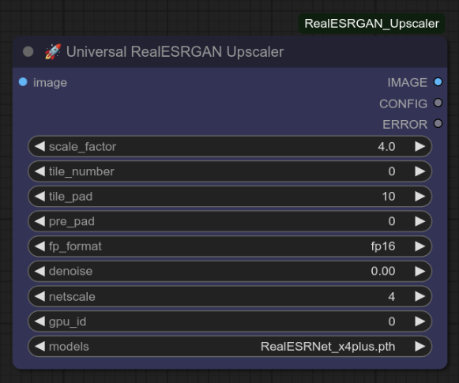

# ComfyUI-RealESRGAN_Upscaler  

> [!IMPORTANT]  
> 
🚧 This documentation is still under 
> construction. The development of the upscaler is a ongoing 
> activity. There might be small differenes in comparison of 
> node and documentation.

> [!CAUTION]
> 
Please note, that the node will run, only
> if an error in one Python package file is fixed. See the 
> related section for informations on this topic.
 

# Preface

This node uses the RealESRGAN model from
xinntao [1]. This is my personal favourite upscaling model and 
upscaling approach.

## Whats New

Yesterday I added a bunch of things to the node.
Now the node is a little bit more complicated than before. On the 
other hand side the node considers now everything which is possible
to do with the node.

## Upscaling

One can set the scaling factor in steps of 0.1
in the node. For the moment there is no known limit for the scaling
factor. I used for example an unrealistic scaling factor of 30.0 
for upscaling of a test image. The limiting factor is in this case 
the size of the image file.

## Node Preview

Figure 1 shows the node preview.

<i>Figure 1: Main node preview</i>

## What the Node Does

to-do ...

## Workflow Preview

Figure 2 shows the example workflow preview.

<i>Figure 2: Workflow preview</i>

Figure 3 shows the example workflow preview.

<i>Figure 3: Workflow preview</i>

## Installation

Use the ComfyUI Manager for the installation. Use my nick 'zentrocdot' or for 
'ComfyUI_realESRGAN_Upscaler'

## Bug Fixing

in the directory is a file called fix.bash. This can be used to fix
the bug in the Python package.

## Error Screen

### Preliminary Note

If you see an error screen which looks like the one below this is still intended as a possibility at present.

<i>Figure 2: Error message preview</i>

The error is easy to explain. Since I opened the
upscaler node for other models than the given ones there may be collisions 
in the parameter settings. This error means that one is using a different
netscale to the one the models needs. In the most of the models there will
be a x2, x4 or x8 and then it is easy to use the right netscale. If there
is no note in the filename to the netscale one needs to guess about the 
right one.
 

### General Remark

While presenting how the node works I figured out a new 
problem. I was able to mess up my system so badly by setting an incorrect 
value for netscale that nothing worked at all. Conclusion is, that I have 
to catch the error, even though I didn't really want to.
 

## Limitations

to-do ...

## To-Do

There are a plenty of things to to

## Credits

Special credits goes to xinntao (Xintao Wang) for his excellent 
work on ESRGAN and RealESRGAN models The results achieved are quite impressive.
 

## Final Words

Have fun. Be inspired!

# Reference

[1] https://github.com/xinntao/Real-ESRGAN

[2] https://github.com/xinntao/Real-ESRGAN/blob/master/docs/model_zoo.md

[3] https://arxiv.org/abs/2107.10833

[3] https://github.com/zentrocdot/ESRGAN_RRBD_CONVERTER

[4] https://github.com/ltdrdata/ComfyUI-Manager
